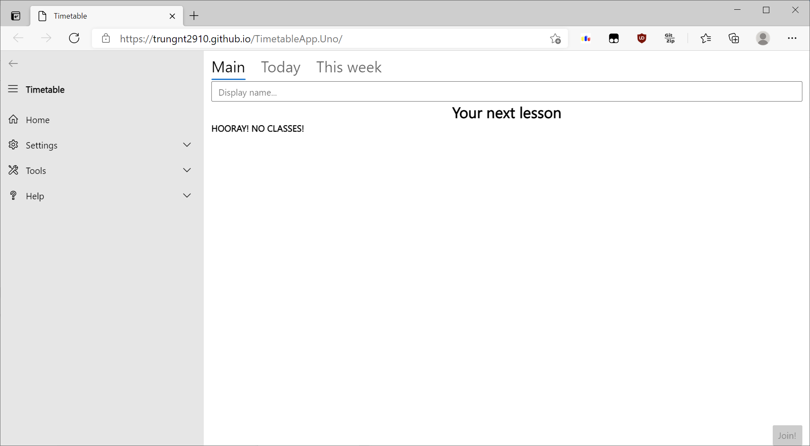
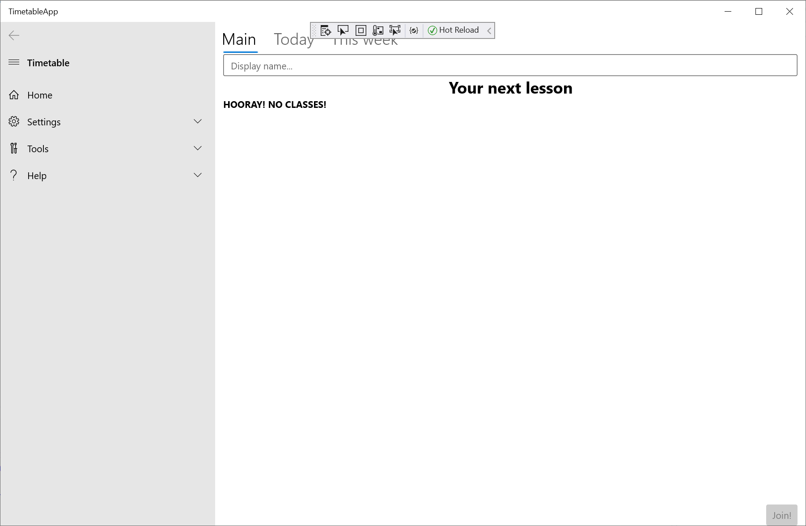
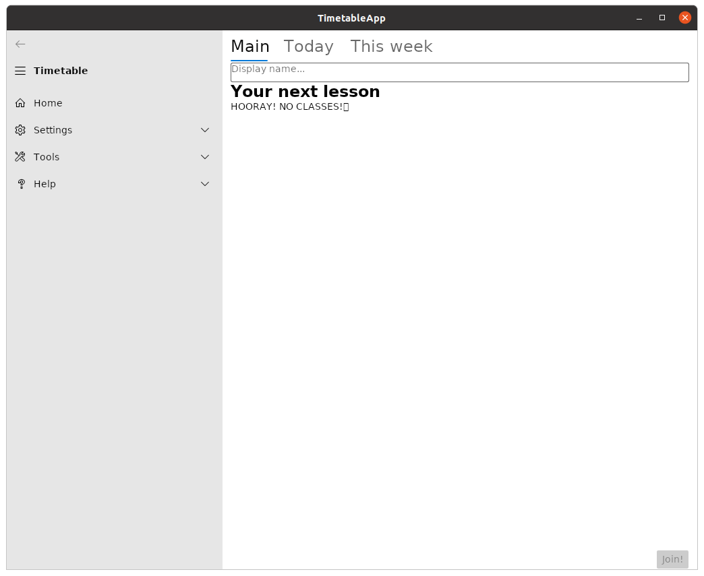
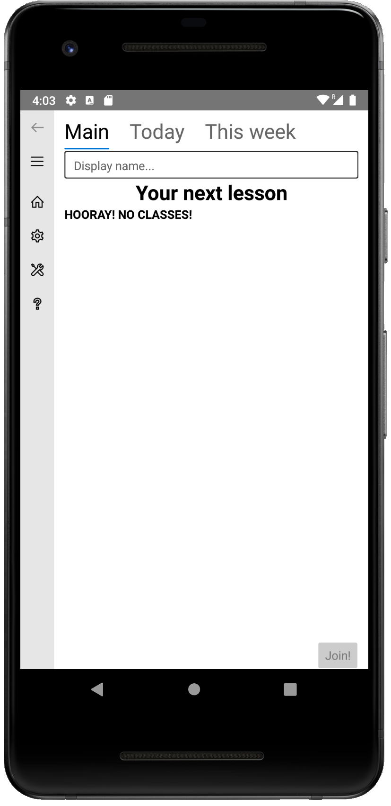

# TimetableApp
Timetable management and automatic online class joining. Created for the Uno Platform, which works on all your devices.

## Try it online:


## Screenshots:
  



## Data format: 
The application downloads the timetable from a URL, provided by the organization. The URL must lead to a JSON file, with this format:

```
{  
   "MD5":"MD5 of real timetable file, for validation.",  
   "Location":"https://example.com/url-to-real-timetable-file"  
}
```

The real timetable file MUST be in this format:

```
{
   "Name":"Name of timetable",  
   "UpdateURL":"Where to check for the next version",  
   "Lessons":[  
        [],  
        [  
               {
                   "StartTime": "07:30:00",  
                   "EndTime": "08:10:00",  
                   "Credentials": {  
                       "$type": "TimetableApp.Core.Zoom.ZoomCredentials, $ASSEMBLY_NAME",  
                       "ID": "room-id",  
                       "Password": "password"  
                       },  
                   "Subject": "subject name",  
                   "TeacherName": "your teacher here",  
                   "Notes": "",  
                   "AdditionalTags": {}  
                   },  
        ]  
   ]  
}  
```

### Remarks:
- `StartTime` and `EndTime`
- `$type` for Credentials is the credentials class you want to use. Currently, we only support Zoom credentials.
- `$ASSEMBLY_NAME` will be internally replaced with the application's assembly name. This is used for compatibility with old versions of the app (Timetable.NET), and with the generator.
- `AdditionalTags` is a `Dictionary<string, string>`, which contains custom properties. 
git 
## Upcoming plans:  
- Timetable Editor: We will create this if the project gets more popularity, as not many teachers know JSON!
- Custom credentials: Currently, our users only use Zoom for online classes. Extensions might be done on user request.

## Related issues:  
### Uno Platform's macOS specific issues:  
- [#7312](https://github.com/unoplatform/uno/issues/7312) \[MacOS\] NavigationView Items not working. (Scheduled for Uno Platform 3.11 release but still not fixed now.)
- [#7319](https://github.com/unoplatform/uno/issues/7319) \[macOS\] Application freezes when DataGrid contains data.

These two issues are making _any_ support for macOS impossible.

### Uno Platform's theming issues:  
- [#7210](https://github.com/unoplatform/uno/issues/7210) Weird dark mode NavigationView colors.
- [#7212](https://github.com/unoplatform/uno/issues/7212) \[Skia.GTK\] Applications do not respond to Dark mode themes. The method Uno Platform uses to detect Dark/Light mode for Skia.GTK is currently faulty.

Because of these two issues, for platforms other than UWP (Windows), we are locking TimetableApp in Light mode.